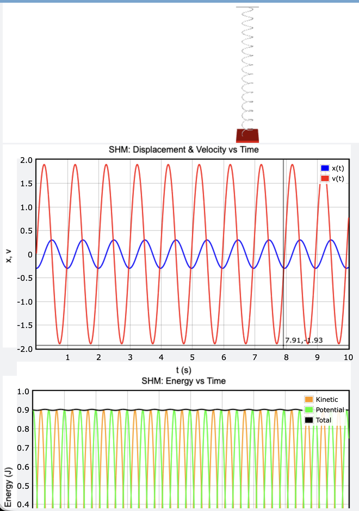

# SCI-103 Physics I — Laboratory 08
## Simple Harmonic Motion using VPython

### 1. วัตถุประสงค์และสิ่งที่ได้เรียนรู้

การทดลองนี้ศึกษาการเคลื่อนที่แบบฮาร์มอนิกอย่างง่าย (Simple Harmonic Motion: **SHM**) ของระบบมวล–สปริงด้วย VPython โดยพิจารณาความสัมพันธ์ระหว่างการกระจัด ความเร็ว ความเร่ง และพลังงานของระบบ

สิ่งที่ได้เรียนรู้จากการทดลอง ได้แก่

- การใช้กฎของฮุก (Hooke’s law) เพื่อคำนวณแรงและความเร่งของมวล
- การใช้วิธี Euler–Cromer ในการคำนวณการเคลื่อนที่เชิงตัวเล��
- ความสัมพันธ์ระหว่างการกระจัด ความเร็ว และความเร่ง
- การเปลี่ยนรูปของพลังงานจลน์และพลังงานศักย์
- หลักการอนุรักษ์พลังงานของระบบสั่น

### 2. ลิงก์โปรแกรม GlowScript

[เปิดโปรแกรมจำลองบน GlowScript](https://www.glowscript.org/#/user/yamaalluddin9470/folder/SIC103-104/program/lab6)

### 3. ผลการทดลองและการคำนวณ

#### 3.1 ค่าที่ใช้ในการจำลอง

| ปริมาณ | สัญลักษณ์ | ค่า |
|---|---:|---:|
| มวล | `m` | 0.5 kg |
| ค่าคงที่สปริง | `k` | 20.0 N/m |
| การกระจัดเริ่มต้น | `x₀` | −0.3 m |
| ความเร็วเริ่มต้น | `v₀` | 0 m/s |
| ช่วงเวลาในการคำนวณ | `dt` | 0.001 s |
| เวลาที่ใช้ในการจำลอง | — | 10 s |

#### 3.2 ความถี่เชิงมุม (Angular Frequency)

ความถี่เชิงมุมของระบบมวล–สปริงคำนวณได้จาก

$$
\omega = \sqrt{\frac{k}{m}}
$$

แทนค่า

$$
\omega = \sqrt{\frac{20}{0.5}} = \sqrt{40}
$$

ดังนั้น

$$
\boxed{\omega \approx 6.32\ \text{rad/s}}
$$

#### 3.3 คาบการสั่น (Period)

คาบการสั่นคำนวณได้จาก

$$
T = \frac{2\pi}{\omega}
$$

แทนค่าโดยใช้ค่าความถี่เชิงมุมที่คำนวณได้

$$
T = \frac{2\pi}{6.32} \approx 0.99\ \text{s}
$$

ดังนั้น มวลใช้เวลาประมาณ **0.99 วินาที** ในการสั่นครบหนึ่งรอบ

#### 3.4 ความเร่งเริ่มต้น (Initial Acceleration)

ความเร่งของระบบหาได้จาก

$$
a = -\frac{k}{m}x
$$

เมื่อ `x = −0.3 m`

$$
a = -\left(\frac{20}{0.5}\right)(-0.3) = 12.0\ \text{m/s}^2
$$

ดังนั้น ความเร่งเริ่มต้นมีค่า **+12.0 m/s²** โดยเครื่องหมายบวกแสดงว่าความเร่งมีทิศทางไปทางตำแหน่งสมดุล ซึ่งอยู่ในทิศตรงข้ามกับการกระจัดเริ่มต้น

#### 3.5 ความเร็วสูงสุด (Maximum Velocity)

สำหรับการเคลื่อนที่แบบ SHM ความเร็วสูงสุดคำนวณได้จาก

$$
v_{\max} = A\omega
$$

โดยมีแอมพลิจูด `A = 0.3 m`

$$
v_{\max} = (0.3)(6.32) \approx 1.90\ \text{m/s}
$$

ดังนั้น ความเร็วสูงสุดมีค่าประมาณ **1.90 m/s** และจะเกิดขึ้นเมื่อมวลเคลื่อนที่ผ่านตำแหน่งสมดุล

#### 3.6 พลังงานรวมของระบบ (Total Energy)

เนื่องจากความเร็วเริ่มต้นเป็นศูนย์ พลังงานเริ่มต้นของระบบจึงอยู่ในรูปของพลังงานศักย์สปริงทั้งหมด โดยพลังงานรวมคำนวณได้จาก

$$
E = \frac{1}{2}kA^2
$$

แทน���่า

$$
E = \frac{1}{2}(20)(0.3)^2 = 0.90\ \text{J}
$$

ดังนั้น พลังงานรวมของระบบมีค่าประมาณ **0.90 J** ในการจำลองด้วยวิธี Euler–Cromer พลังงานรวมอาจมีการเปลี่ยนแปลงเล็กน้อยจากค่าทฤษฎีเนื่องจากความคลาดเคลื่อนเชิงตัวเลข แต่เมื่อ `dt` มีค่าขนาดเล็ก พลังงานควรใกล้เคียงกับค่าดังกล่าว

### 4. ผลจากการจำลอง

จากการจำลองพบว่ามวลเคลื่อนที่กลับไปกลับมารอบตำแหน่งสมดุลอย่างเป็นคาบ โดยมีลักษณะสำคัญดังนี้

- เมื่อการกระจัดมีค่าสูงสุด ความเร็วจะมีค่าใกล้ศูนย์ เพราะมวลกำลังเปลี่ยนทิศทางการเคลื่อนที่
- เมื่อมวลเคลื่อนที่ผ่านตำแ���น่งสมดุล การกระจัดจะมีค่าใกล้ศูนย์ แต่ความเร็วจะมีค่ามากที่สุด
- ความเร่งมีทิศตรงข้ามกับการกระจัด และมีขนาดแปรผันตามขนาดของการกระจัด
- พลังงานจลน์และพลังงานศักย์จะเพิ่มขึ้นและลดลงสลับกัน
- พลังงานรวมมีค่าประมาณ 0.90 J และเกือบคงที่ตลอดการจำลอง ซึ่งแสดงถึงการอนุรักษ์พลังงานของระบบ

*รูปที่ 1 ผลการจำลอง Simple Harmonic Motion และกราฟการกระจัด ความเร็ว และพลังงาน*

### 5. อภิปรายผล

การทดลองแสดงให้เห็นว่าระบบมวล–สปริงมีการเคลื่อนที่แบบฮาร์มอนิกอย่างง่าย โดยแรงสปริงเป็นแรงคืนสู่สมดุลที่มีขนาดแปรผันตรงกับการกระจัดและมีทิศตรงข้ามกับการกระจัด ตามกฎของฮุก

จากกราฟการกระจัดและความเร็วพบว่าทั้งสองปริมาณเปลี่ยนแปลงเป็นคาบ และมีเฟสต่างกัน โดยความเร็วมีค่ามากที่สุดเมื่อมวลผ่านตำแหน่งสมดุล และมีค่าเป็นศูนย์เมื่อมวลอยู่ที่ตำแหน่งปลายสุดของการสั่น

สำหรับกราฟพลังงาน พลังงานศักย์และพลังงานจลน์จะเปลี่ยนรูปสลับกัน พลังงานศักย์มีค่ามากที่สุดที่ตำแหน่งปลายสุด ส่วนพลังงานจลน์มีค่ามากที่สุดที่ตำแหน่งสมดุล ผลรวมของพลังงานทั้งสองมีค่าใกล้เคียงกับ 0.90 J ตลอดการจำลอง ความคลาดเคลื่อนเล็กน้อยที่อาจพบเกิดจากการคำนวณเชิงตัวเลขด้วยวิธี Euler–Cromer

### 6. สรุปผลการทดลอง

การทดลองนี้ศึกษาการเคลื่อนที่แบบฮาร์มอนิกอย่างง่ายของระบบมวล–สปริงด้วย VPython และวิธี Euler–Cromer

ผลการคำนวณได้ความถี่เชิงมุมประมาณ **6.32 rad/s** และคาบการสั่นประมาณ **0.99 s** เมื่อกำหนดให้มวลมีค่า 0.5 kg ค่าคงที่สปริง 20.0 N/m และแอมพลิจูด 0.3 m ความเร่งเริ่มต้นมีค่า **12.0 m/s²** และความเร็วสูงสุดมีค่าประมาณ **1.90 m/s**

ผลจากการจำลองสอดคล้องกับทฤษฎีของ SHM กล่าวคือ การกระจัดและความเร็วเปลี่ยนแปลงเป็นคาบ ความเร็วมีค่ามากที่สุดเมื่อมวลผ่านตำแหน่งสมดุล และพลังงานศักย์กับพลังงานจลน์เปลี่ยนรูปสลับกัน โดยมีพลังงานรวมประมาณ **0.90 J** ซึ่งเกือบคงที่ตลอดการจำลอง
