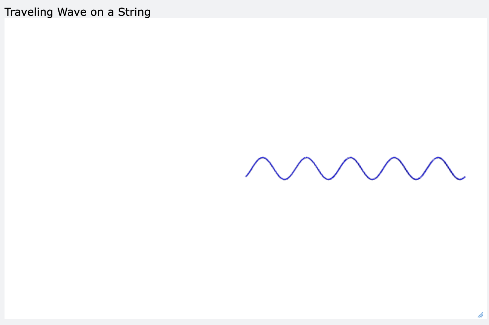

# SCI-103 Physics I — Laboratory Report 09

## Traveling Wave on a String

> รายงานการจำลองคลื่นเดินทางบนเส้นเชือกด้วย **VPython**

---

## 1. วัตถุประสงค์และสิ่งที่ได้เรียนรู้

การทดลองนี้มีวัตถุประสงค์เพื่อศึกษาพฤติกรรมของ **คลื่นเดินทาง (Traveling Wave)** บนเส้นเชือก โดยใช้ VPython สร้างแบบจำลองการเคลื่อนที่ของคลื่นแบบไซน์

จากการทดลองทำให้เข้าใจความหมายและความสัมพันธ์ของปริมาณสำคัญ ได้แก่

- แอมพลิจูด (Amplitude, `A`)
- ความยาวคลื่น (Wavelength, `λ`)
- ความถี่ (Frequency, `f`)
- เลขคลื่น (Wave Number, `k`)
- ความถี่เชิงมุม (Angular Frequency, `ω`)
- อัตราเร็วคลื่น (Wave Speed, `v`)
- คาบ (Period, `T`)

การจำลองช่วยให้มองเห็นการเคลื่อนที่ของรูปร่างคลื่นได้อย่างชัดเจน และเชื่อมโยงสมการทางฟิสิกส์เข้ากับปรากฏการณ์ที่เกิดขึ้นจริงได้ดียิ่งขึ้น

## 2. ลิงก์โปรแกรมจำลอง

[เปิดโปรแกรม Traveling Wave on a String บน GlowScript](https://www.glowscript.org/#/user/yamaalluddin9470/folder/SIC103-104/program/LAB6)

## 3. อุปกรณ์และค่าที่ใช้ในการจำลอง

| ปริมาณ | สัญลักษณ์ | ค่า | หน่วย |
|---|:---:|---:|:---:|
| แอมพลิจูด | `A` | 1.0 | m |
| ความยาวคลื่น | `λ` | 4.0 | m |
| ความถี่ | `f` | 1.0 | Hz |
| ความยาวเส้นเชือก | `L` | 20.0 | m |
| จำนวนจุดที่ใช้จำลอง | `N` | 200 | จุด |
| ช่วงเวลาในการคำนวณ | `dt` | 0.02 | s |

## 4. ทฤษฎีและการคำนวณ

### 4.1 สมการคลื่นเดินทาง

สมการที่ใช้ในการจำลองคือ

$$
y(x,t) = A\sin(kx - \omega t)
$$

โดยเครื่องหมายลบระหว่าง `kx` และ `ωt` แสดงว่าคลื่นเคลื่อนที่ไปในทิศทาง **+x**

### 4.2 การคำนวณเลขคลื่น

เลขคลื่นคำนวณได้จาก

$$
k = \frac{2\pi}{\lambda}
$$

แทนค่า `λ = 4.0 m`

$$
k = \frac{2\pi}{4.0} \approx 1.57\ \text{rad/m}
$$

ดังนั้น เลขคลื่นมีค่า **`k ≈ 1.57 rad/m`**

### 4.3 การคำนวณความถี่เชิงมุม

ความถี่เชิงมุมคำนวณได้จาก

$$
\omega = 2\pi f
$$

แทนค่า `f = 1.0 Hz`

$$
\omega = 2\pi(1.0) \approx 6.28\ \text{rad/s}
$$

ดังนั้น ความถี่เชิงมุมมีค่า **`ω ≈ 6.28 rad/s`**

### 4.4 การคำนวณอัตราเร็วคลื่น

อัตราเร็วคลื่นคำนวณได้จาก

$$
v = \frac{\omega}{k}
$$

แทนค่า

$$
v = \frac{6.28}{1.57} \approx 4.0\ \text{m/s}
$$

สามารถตรวจสอบด้วยความสัมพันธ์อีกวิธีหนึ่งได้ดังนี้

$$
v = f\lambda = (1.0)(4.0) = 4.0\ \text{m/s}
$$

ผลลัพธ์จากทั้งสองวิธีเท่ากัน แสดงว่าความสัมพันธ์ระหว่างอัตราเร็วคลื่น ความถี่ และความยาวคลื่นสอดคล้องกัน

### 4.5 การคำนวณคาบ

คาบของคลื่นคำนวณได้จาก

$$
T = \frac{1}{f}
$$

แทนค่า `f = 1.0 Hz`

$$
T = \frac{1}{1.0} = 1.0\ \text{s}
$$

ดังนั้น คลื่นใช้เวลา **1.0 วินาที** ในการเคลื่อนที่ครบหนึ่งรอบ

## 5. ผลการทดลอง

**รูปที่ 1** ผลการจำลองคลื่นเดินทางบนเส้นเชือกด้วย VPython

จากภาพการจำลองพบว่าเส้นเชือกมีลักษณะเป็นคลื่นไซน์ โดยมีสันคลื่นและท้องคลื่นเกิดขึ้นต่อเนื่องกัน และรูปแบบของคลื่นเคลื่อนที่ไปตามแนวเส้นเชือกในทิศทาง `+x`

จำนวนความยาวคลื่นที่ปรากฏบนเส้นเชือกคำนวณได้จาก

$$
\frac{L}{\lambda} = \frac{20}{4} = 5
$$

ดังนั้น เส้นเชือกยาว `20 m` สามารถแสดงคลื่นได้ประมาณ **5 ความยาวคลื่น** ซึ่งสอดคล้องกับผลจากการจำลอง

## 6. อภิปรายผล

จากการทดลองพบว่าแอมพลิจูดเป็นตัวกำหนดการกระจัดสูงสุดของจุดบนเส้นเชือก หากเพิ่มแอมพลิจูด คลื่นจะมีสันคลื่นและท้องคลื่นสูงขึ้นหรือต่ำลง แต่ไม่ได้ทำให้ความยาวคลื่นเปลี่ยนแปลงโดยตรง

ความยาวคลื่นคือระยะทางระหว่างจุดที่มีเฟสเดียวกันของคลื่นที่อยู่ติดกัน เช่น ระยะระหว่างสันคลื่นสองสันที่อยู่ติดกัน ส่วนความถี่คือจำนวนรอบของคลื่นที่เกิดขึ้นในหนึ่งวินาที

เมื่อกำหนดให้ `f = 1.0 Hz` และ `λ = 4.0 m` จะได้อัตราเร็วคลื่นเท่ากับ `4.0 m/s` การจำลองด้วย VPython ช่วยให้เห็นการเปลี่ยนแปลงของตำแหน่งคลื่นตามเวลาได้ชัดเจนกว่าการพิจารณาจากสมการเพียงอย่างเดียว

## 7. สรุปผลการทดลอง

การทดลองนี้ได้ศึกษาคลื่นเดินทางบนเส้นเชือกโดยใช้ VPython สร้างแบบจำลอง จากค่าที่กำหนดให้

- แอมพลิจูด `A = 1.0 m`
- ความยาวคลื่น `λ = 4.0 m`
- ความถี่ `f = 1.0 Hz`

สามารถคำนวณได้ว่า

- เลขคลื่น `k ≈ 1.57 rad/m`
- ความถี่เชิงมุม `ω ≈ 6.28 rad/s`
- อัตราเร็วคลื่น `v = 4.0 m/s`
- คาบ `T = 1.0 s`

ผลการจำลองแสดงคลื่นไซน์ประมาณ **5 ความยาวคลื่น** บนเส้นเชือกยาว `20 m` ซึ่งสอดคล้องกับค่าที่คำนวณได้จากทฤษฎี
