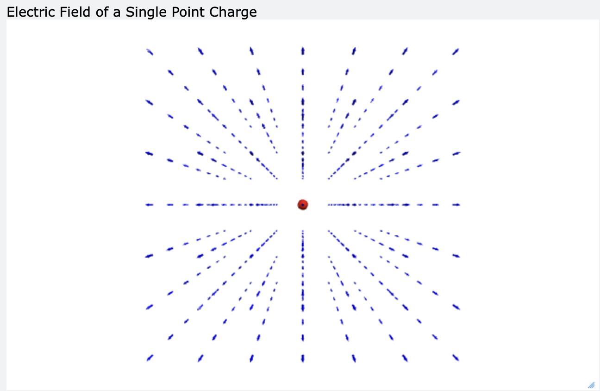
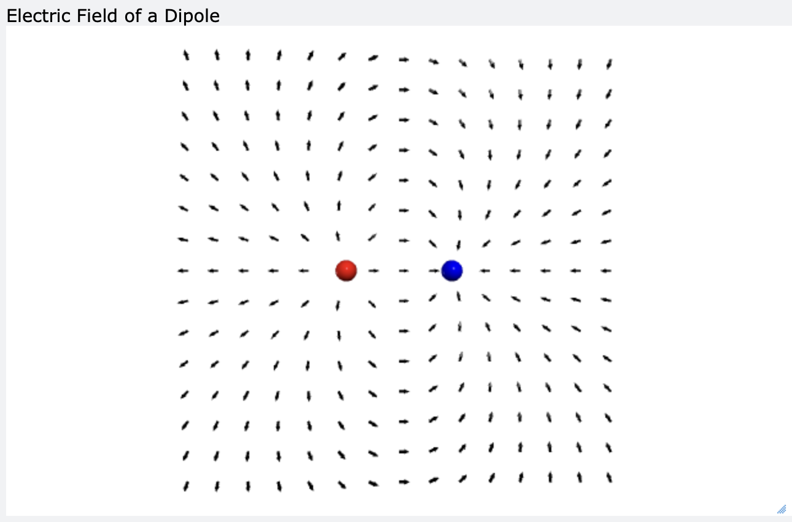
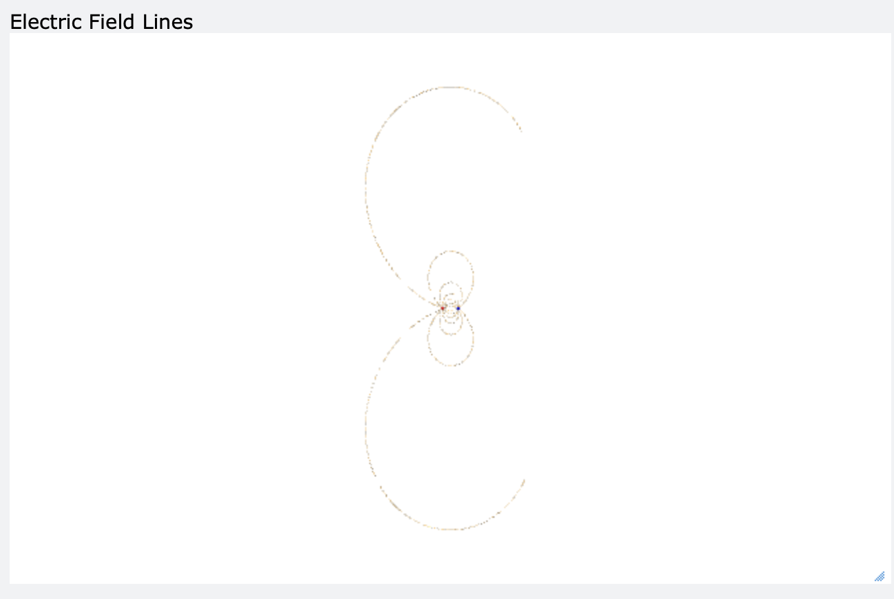

# Lab 11: Visualization of Electric Fields using VPython

## 1. Achievement

การทดลองนี้ทำให้ผมเข้าใจเรื่องสนามไฟฟ้า (Electric Field) มากขึ้น โดยได้ศึกษาการกระจายตัว ทิศทาง และความเข้มของสนามไฟฟ้าที่เกิดจากประจุไฟฟ้ารูปแบบต่าง ๆ ผ่านการจำลองด้วย VPython ใน GlowScript

## 2. GlowScript URLs

### Part A

[เปิดโปรแกรม Part A](https://www.glowscript.org/#/user/yamaalluddin9470/folder/SIC103-104/program/lab10-partA)

### Part B

[เปิดโปรแกรม Part B](https://www.glowscript.org/#/user/yamaalluddin9470/folder/SIC103-104/program/lab10-partB)

### Part C

[เปิดโปรแกรม Part C](https://www.glowscript.org/#/user/yamaalluddin9470/folder/SIC103-104/program/lab10-partC)

## 3. Results

### Part A: Electric Field of a Single Point Charge

**รูปที่ 1** ผลการจำลองสนามไฟฟ้าของประจุจุดเดี่ยว

จากการจำลองสนามไฟฟ้าของประจุเดี่ยว พบว่าลูกศรสนามไฟฟ้าทั้งหมดชี้ออกจากประจุบวก แสดงให้เห็นว่าสนามไฟฟ้าของประจุบวกมีทิศทางพุ่งออกจากประจุ นอกจากนี้ ความยาวของลูกศรจะลดลงเมื่ออยู่ห่างจากประจุมากขึ้น ซึ่งแสดงว่าความเข้มของสนามไฟฟ้าลดลงตามระยะทาง

### Part B: Electric Field of a Dipole

**รูปที่ 2** ผลการจำลองสนามไฟฟ้าของไดโพล

ในการท��ลองไดโพล (Dipole) ซึ่งประกอบด้วยประจุบวกและประจุลบ พบว่าทิศทางของสนามไฟฟ้าเริ่มต้นจากประจุบวกและชี้เข้าสู่ประจุลบ สนามไฟฟ้าในบริเวณระหว่างประจุมีความหนาแน่นมากกว่า จึงมีความเข้มสูงกว่าบริเวณที่อยู่ห่างออกไป

### Part C: Electric Field Lines

**รูปที่ 3** ผลการจำลองเส้นสนามไฟฟ้า

จากการแสดงเส้นสนามไฟฟ้า พบว่าเส้นสนามเริ่มต้นจากประจุบวกและสิ้นสุดที่ประจุลบ เส้นสนามจะไม่ตัดกัน และบริเวณที่เส้นสนามอยู่ชิดกันจะแสดงถึงสนามไฟฟ้าที่มีความเข้มมากกว่า ส่วนบร��เวณที่เส้นสนามอยู่ห่างกันจะแสดงถึงสนามไฟฟ้าที่มีความเข้มน้อยกว่า

## 4. Discussion

จากผลการทดลองพบว่าสนามไฟฟ้ามีทิศทางเป็นไปตามทฤษฎี คือ สนามไฟฟ้าของประจุบวกชี้ออกจากประจุ และสนามไฟฟ้าของประจุลบชี้เข้าสู่ประจุ ความเข้มของสนามไฟฟ้าจะลดลงเมื่อระยะห่างจากประจุเพิ่มขึ้น โดยมีความสัมพันธ์แบบแปรผกผันกับกำลังสองของระยะทาง

สำหรับกรณีไดโพล สนามไฟฟ้าที่เกิดขึ้นเป็นผลรวมของสนามจากประจุบวกและประจุลบตามหลักการซ้อนทับ (Superposition Principle) จึงทำให้เกิดรูปแบบเส้นสนามที่เชื่อมต่อระหว่างประจุทั้งสอง การใช้ VPython ช่วยให้สามารถมองเห็นทิศทางและการกระจายตัวของสนามไฟฟ้าได้ชัดเจนยิ่งขึ้น

## 5. Post-Lab Questions

### 1. What is the direction of the electric field around positive and negative charges?

สนามไฟฟ้าชี้ออกจากประจุบวก และชี้เข้าสู่ประจุลบ

### 2. Why does the electric field become weaker farther from a charge?

เพราะความแรงของสนามไฟฟ้าลดลงตามระยะทาง โดยมีค่าแปรผกผันกับกำลังสองของระยะห่างจากประจุ ดังนั้นเมื่ออยู่ห่างจากประจุมากขึ้น สนามไฟฟ้าจึงมีความเข้มน้อยลง

### 3. What is the Superposition Principle?

คือหลักการที่กล่าวว่าสนามไฟฟ้ารวมที่จุดใดจุดหนึ่งเกิดจากผลรวมแบบเวกเตอร์ของสนามไฟฟ้าที��สร้างโดยประจุแต่ละตัว

### 4. How is a dipole field different from a single-charge field?

สนามของไดโพลเกิดจากประจุสองชนิด คือประจุบวกและประจุลบ ทำให้เส้นสนามไฟฟ้าเริ่มจากประจุบวกและสิ้นสุดที่ประจุลบ ส่วนสนามของประจุเดี่ยวจะมีเส้นสนามแผ่ออกจากประจุบวกหรือพุ่งเข้าสู่ประจุลบเพียงตัวเดียว
