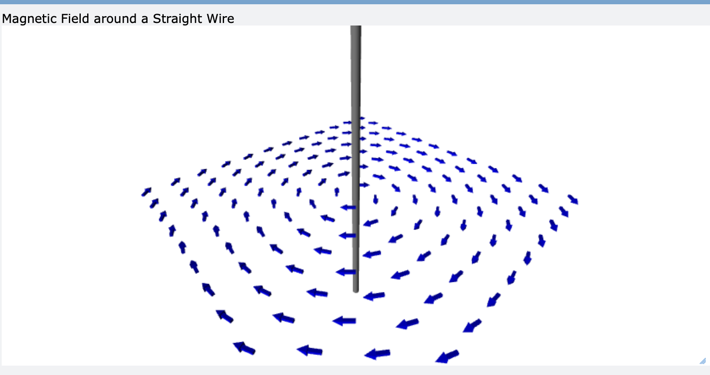
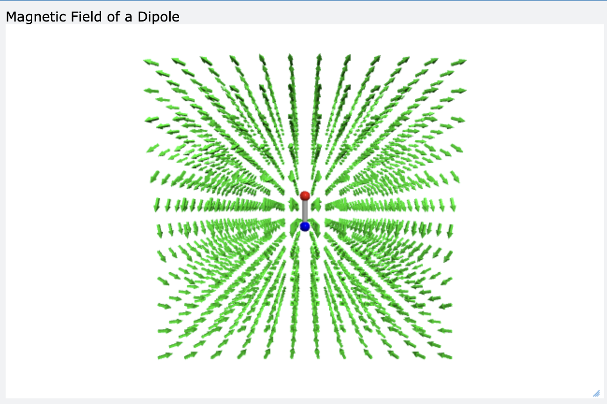

# SCI-103 Physics I – Lab 12 Report

**Visualization of Magnetic Fields using VPython**

---

## 1. Achievement

จาก Lab 12 ผมใช้ GlowScript VPython จำลองสนามแม่เหล็ก 3 แบบ และเชื่อมภาพที่เห็นเข้ากับสมการ

- **Part A – ลวดตรงที่มีกระแสไฟฟ้า:** สนามแม่เหล็กวนเป็นวงกลมรอบลวด ขนาดลดลงตาม 1/r (สมการ 1–2)
- **Part B – Magnetic Dipole:** สร้างสนามเวกเตอร์ 3 มิติของแม่เหล็กสองขั้ว ขนาดลดลงตาม 1/r³ (สมการ 3–5)
- **Part C – เส้นสนามแม่เหล็ก:** ลากเส้นโดยเดินตามทิศของ B ทีละก้าว (สมการ 6) แต่ผลที่ได้ยังไม่ครบตามทฤษฎี (ดูข้อ 4.3)

สิ่งสำคัญที่ได้เรียนรู้คือการแยก **"ทิศ"** ที่ลูกศรแสดง ออกจาก **"ขนาด"** ที่ต้องอ่านจากสมการ เพราะลูกศรในโปรแกรมถูกปรับให้ยาวเท่ากัน (normalize) จึงบอกได้แค่ทิศทางของสนาม

---

## 2. GlowScript URL (Shared)

### Part A
https://www.glowscript.org/#/user/yamaalluddin9470/folder/LAB12/program/LAB12PartA

### Part B
https://www.glowscript.org/#/user/yamaalluddin9470/folder/LAB12/program/LAB12PartB

### Part C
https://www.glowscript.org/#/user/yamaalluddin9470/folder/LAB12/program/LAB12PartC

---

## 3. Results

### ค่าพารามิเตอร์ที่ใช้

<!-- ตรวจค่าในตารางนี้ให้ตรงกับโค้ดจริงของคุณก่อนส่ง -->

| Part | พารามิเตอร์ |
|---|---|
| A | μ₀ = 4π×10⁻⁷ T·m/A, I = 5.0 A, ลวดตามแกน y ยาว 4, กริด 12×12 บนระนาบ y = 0 ครอบคลุม x, z ∈ [−2, 2], ข้ามจุดที่ r < 0.2, ความยาวลูกศร 0.2 |
| B | m = (0, 1, 0), ขั้วเหนือ (แดง) ที่ y = +0.3 และขั้วใต้ (น้ำเงิน) ที่ y = −0.3, กริด 12×12×12 ครอบคลุม [−2, 2]³, ความยาวลูกศร 0.2 |
| C | เริ่มเส้นจาก 16 จุด รัศมี 0.15 รอบแกน y ที่ y = 0.3, ก้าวละ Δs = 0.05, ไม่เกิน 800 ก้าว, หยุดเมื่อ \|r\| > 3 หรือ \|B\| < 10⁻⁶ |

---

### Part A: สนามแม่เหล็กของลวดตรง

ขนาดของสนามแม่เหล็กที่ระยะ r จากลวดตรงยาว:

$$
B = \frac{\mu_0 I}{2\pi r} \tag{1}
$$

ทิศของสนามเป็นวงกลมรอบลวด (ทิศสัมผัส) ซึ่งในโปรแกรมเขียนเป็นเวกเตอร์ได้ว่า:

$$
\mathbf{B} = \frac{\mu_0 I}{2\pi r}\,\hat{\boldsymbol{\phi}}, \qquad
\hat{\boldsymbol{\phi}} = \frac{(-z,\;0,\;x)}{\sqrt{x^{2}+z^{2}}} \tag{2}
$$

โดยที่

- **B** คือ ความหนาแน่นสนามแม่เหล็ก (หน่วย T)
- **μ₀** คือ ค่าคงที่ทางแม่เหล็ก = 4π×10⁻⁷ T·m/A
- **I** คือ กระแสไฟฟ้า (หน่วย A)
- **r** คือ ระยะตั้งฉากจากลวดถึงจุดที่พิจารณา, r = √(x² + z²) (หน่วย m)
- **φ̂** คือ เวกเตอร์หนึ่งหน่วยในทิศสัมผัสวงกลมรอบลวด

**ทิศของกระแส:** ที่จุด (1, 0, 0) สมการ (2) ให้ B ชี้ไปทาง +z ตามกฎมือขวา (นิ้วโป้งชี้ตามกระแส นิ้วที่เหลือโค้งตามสนาม) ทิศ B นี้สอดคล้องกับกระแสที่ไหลในทิศ **−y (ลงล่าง)** ตามแนวลวด

**ภาพผลการทดลอง Part A:**

*รูปที่ 1: สนามแม่เหล็กรอบลวดตรง (I = 5.0 A) ลูกศรทุกอันยาวเท่ากัน*

**สิ่งที่เห็นจากภาพ**

1. ลูกศรเรียงเป็นวงกลมรอบลวด ตรงกับทิศทางในสมการ (2)
2. ลูกศรทุกอันยาวเท่ากัน (0.2) ส่วนที่ดูใหญ่เล็กต่างกันมาจากมุมมองของกล้อง ไม่ได้มาจากค่า B
3. ค่า B ถูกคำนวณในโค้ดแล้ว แต่ยังไม่ได้ใช้กำหนดความยาวลูกศร ภาพนี้จึงยืนยันได้เฉพาะ **ทิศ** ส่วนความสัมพันธ์ของ **ขนาด** ต่อ I และ r อ่านจากสมการ (1)

> ⚠️ **TODO (ลบบรรทัดนี้เมื่อทำเสร็จ):** รันโปรแกรมอีกครั้งด้วย I = −5.0 A แล้วบันทึกภาพเป็น `part-a-reversed.png` จากนั้นวางรูปตรงนี้ด้วย `` พร้อมเขียนสิ่งที่เห็นจริง

---

### Part B: สนามแม่เหล็กของ Magnetic Dipole

$$
\mathbf{B}(\mathbf{r}) = \frac{\mu_0}{4\pi}\left[\frac{3(\mathbf{m}\cdot\mathbf{r})\,\mathbf{r}}{|\mathbf{r}|^{5}} - \frac{\mathbf{m}}{|\mathbf{r}|^{3}}\right] \tag{3}
$$

โดยที่ **m** คือเวกเตอร์โมเมนต์แม่เหล็ก (หน่วย A·m²) และ **r** คือ **เวกเตอร์ตำแหน่ง** จากจุดกึ่งกลางของแม่เหล็กถึงจุดที่พิจารณา (ต่างจาก r ในสมการ 1 ซึ่งเป็นระยะทางสเกลาร์) ที่ตัวหารเป็น |r|⁵ เพราะ r ในเทอมแรกเป็นเวกเตอร์ยาว |r| ไม่ใช่เวกเตอร์หนึ่งหน่วย เมื่อรวมแล้วสนามยังลดตาม 1/|r|³

สองกรณีพิเศษที่ตรวจกับภาพได้:

$$
\text{บนแกนของ } \mathbf{m}\ (\mathbf{r}\parallel\mathbf{m}):\quad
\mathbf{B} = \frac{\mu_0}{2\pi}\frac{\mathbf{m}}{|\mathbf{r}|^{3}} \quad (\text{ทิศเดียวกับ } \mathbf{m}) \tag{4}
$$

$$
\text{บนระนาบกลาง } (\mathbf{r}\perp\mathbf{m}):\quad
\mathbf{B} = -\frac{\mu_0}{4\pi}\frac{\mathbf{m}}{|\mathbf{r}|^{3}} \quad (\text{ทิศตรงข้าม } \mathbf{m}) \tag{5}
$$

**ภาพผลการทดลอง Part B:**

*รูปที่ 2: สนามแม่เหล็กของ dipole ที่ m = (0, 1, 0) ลูกศรทุกอันยาวเท่ากัน*

**สิ่งที่เห็นจากภาพ**

1. รูปแบบสนามคล้ายสนามของแท่งแม่เหล็ก โค้งออกจากขั้วเหนือ (แดง) และวนเข้าขั้วใต้ (น้ำเงิน)
2. ที่แถบกลางระนาบระหว่างสองขั้ว ลูกศรชี้ลง (ตรงข้ามกับ m ที่ชี้ขึ้น) ตรงกับสมการ (5)
3. ลูกศรถูกทำให้ยาวเท่ากัน ภาพจึงบอกไม่ได้ว่าสนามใกล้ขั้วแรงกว่าไกลออกไปเท่าไร ต้องอ่านจากสมการ (3): B ∝ 1/|r|³

---

### Part C: เส้นสนามแม่เหล็ก

เส้นสนามคือเส้นที่สัมผัสกับทิศของ B ทุกจุด โปรแกรมสร้างเส้นโดยเริ่มจากจุดเริ่มต้นใกล้ขั้วเหนือ แล้วเดินตามทิศของ B ทีละก้าว:

$$
\mathbf{r}_{n+1} = \mathbf{r}_{n} + \Delta s\,\hat{\mathbf{B}}(\mathbf{r}_{n}),
\qquad \hat{\mathbf{B}} = \frac{\mathbf{B}}{|\mathbf{B}|},\quad \Delta s = 0.05 \tag{6}
$$

โดยที่ B คำนวณจากสมการ (3)

**ภาพผลการทดลอง Part C:**

*รูปที่ 3: เส้นสนามที่เริ่มจากรอบขั้วเหนือ*

**สิ่งที่เห็นจากภาพ**

- เส้นสนามพุ่งออกจากขั้วเหนือและโค้งออกด้านนอกตามที่คาด
- เส้นสั้นมาก **ไม่ไปถึงขั้วใต้** และยังไม่เห็นเป็นวงปิด ผลนี้ยังไม่แสดงลักษณะเส้นสนามที่ต่อเนื่องตามทฤษฎี (ดูข้อ 4.3)

> ⚠️ **TODO (ลบบรรทัดนี้เมื่อทำเสร็จ):** ตรวจและแก้เงื่อนไขหยุดใน Part C ตามข้อ 4.3 แล้วรันใหม่ ถ่ายภาพใหม่มาแทน `part-c.png` และปรับข้อความ "สิ่งที่เห็นจากภาพ" ให้ตรงกับผลจริง

---

## 4. Discussion

### 4.1 สิ่งที่ยืนยันได้จากภาพ

| ข้อสรุป | หลักฐาน |
|---|---|
| B รอบลวดตรงมีทิศเป็นวงกลม | ภาพ Part A + สมการ (2) |
| สนามของ dipole มีรูปแบบเหมือนแท่งแม่เหล็ก | ภาพ Part B |
| ที่ระนาบกลาง B ตรงข้ามกับ m | ภาพ Part B + สมการ (5) |

### 4.2 สิ่งที่มาจากสมการ (ภาพยังไม่ได้แสดงโดยตรง)

- **ขนาด B ของลวดตรง:** เพิ่มตาม I และลดตามระยะ r ตามสมการ (1) ภาพ Part A แสดงเฉพาะทิศ
- **ขนาด B ของ dipole:** ลดตาม 1/|r|³ ตามสมการ (3) ซึ่งลดเร็วกว่าลวดตรงที่ลดตาม 1/r
- **การกลับทิศกระแส:** จากสมการ (1)–(2) B เป็นสัดส่วนตรงกับ I ดังนั้นเมื่อ I เปลี่ยนเครื่องหมาย B ทุกจุดกลับทิศ (ผลนี้ยังรอภาพยืนยันจากการรัน I = −5.0 A)

### 4.3 ข้อจำกัด

1. **ลูกศรแสดงเฉพาะทิศ (Part A และ B):** ใน Part A ค่า B ถูกคำนวณแล้วแต่ไม่ได้ใช้กำหนดความยาวลูกศร และใน Part B ลูกศรถูกทำให้ยาวเท่ากัน (normalize) จึงบอกความแรงของสนามจากภาพไม่ได้ทั้งสองส่วน ถ้าจะให้ลูกศรแสดงขนาดด้วยต้องกำหนดสเกลให้เหมาะสม เพราะ B มีค่าอยู่ในระดับ 10⁻⁷
2. **เส้นสนามใน Part C สั้นเกินไป:** เส้นหยุดก่อนไปถึงขั้วใต้ สันนิษฐานว่าเกิดจากเงื่อนไขหยุด |B| < 10⁻⁶ เพราะ μ₀/4π = 10⁻⁷ ทำให้ |B| ตกต่ำกว่า 10⁻⁶ ที่ระยะประมาณครึ่งหน่วยจากจุดศูนย์กลาง เส้นจึงถูกตัดก่อนเวลา (ยังต้องตรวจยืนยันโดยแก้ค่าแล้วรันใหม่)
3. **โมเดล dipole เป็นการประมาณ:** สมการ (3) ใช้ได้ดีเมื่อห่างจากแม่เหล็กมากกว่าขนาดของแม่เหล็ก จึงข้ามจุดที่ใกล้ศูนย์กลางเกินไป

### 4.4 คำตอบคำถามท้ายการทดลอง

**1. สนามแม่เหล็กของลวดตรงมีความแรงขึ้นอยู่กับระยะห่างอย่างไร**
จากสมการ (1) B ∝ 1/r คือลดลงแบบผกผันกับระยะ ถ้าระยะเพิ่มเป็น 2 เท่า B จะเหลือครึ่งหนึ่ง เช่น ที่ I = 5 A, B(r = 0.5 m) = 2×10⁻⁶ T และ B(r = 1 m) = 1×10⁻⁶ T

**2. ถ้าเพิ่มโมเมนต์แม่เหล็กเป็นสองเท่า จะเกิดอะไรขึ้น**
สมการ (3) เป็นเชิงเส้นกับ **m** ดังนั้นถ้า m เป็น 2 เท่า B ทุกจุดจะเป็น 2 เท่า โดยทิศและรูปแบบสนามไม่เปลี่ยน แต่ในภาพจำลอง ลูกศรจะยาวเท่าเดิมเพราะถูก normalize จึงมองไม่เห็นความต่างจากภาพ

**3. สนามแม่เหล็กของ magnetic dipole แตกต่างจากสนามไฟฟ้าของ electric dipole อย่างไร**
เมื่ออยู่ไกลจากแหล่งกำเนิด ทั้งสองมีรูปแบบทางคณิตศาสตร์เหมือนกัน

$$
\mathbf{E}(\mathbf{r}) = \frac{1}{4\pi\varepsilon_0}\left[\frac{3(\mathbf{p}\cdot\mathbf{r})\,\mathbf{r}}{|\mathbf{r}|^{5}} - \frac{\mathbf{p}}{|\mathbf{r}|^{3}}\right] \tag{7}
$$

เมื่อเทียบกับสมการ (3) จะเห็นว่าโครงสร้างเหมือนกัน (p คือโมเมนต์ไดโพลไฟฟ้า) จึงมีเส้นโค้งคล้ายกัน ความต่างอยู่ที่แหล่งกำเนิด: เส้นสนามไฟฟ้าเริ่มที่ประจุบวกและสิ้นสุดที่ประจุลบ แต่ไม่มีขั้วแม่เหล็กเดี่ยว ทำให้ฟลักซ์แม่เหล็กรวมผ่านผิวปิดเป็นศูนย์

$$
\oint \mathbf{B}\cdot d\mathbf{A} = 0 \tag{8}
$$

เส้นสนามแม่เหล็กจึงเป็นวงปิด ต่อเนื่องผ่านภายในแท่งแม่เหล็กจากขั้วใต้ไปขั้วเหนือ

**4. กฎมือขวาใช้หาทิศทางของสนามแม่เหล็กได้อย่างไร**
ให้นิ้วโป้งชี้ตามทิศกระแส นิ้วที่เหลือที่โค้งเข้าหาฝ่ามือคือทิศของ B รอบลวด ใน Part A สมการ (2) ที่จุด (1, 0, 0) ให้ B ชี้ +z ซึ่งตรงกับกระแสที่ไหลในทิศ −y

**5. ถ้าหมุนโมเมนต์แม่เหล็กไปตามแกน x จะเกิดอะไรขึ้น**
จากสมการ (4)–(5) เมื่อ m = (1, 0, 0) แกนของ dipole เปลี่ยนเป็นแกน x รูปแบบสนามทั้งหมดหมุนตามไปด้วย: บนแกน x, B ชี้ไปทางเดียวกับ m และที่ระนาบกลางซึ่งกลายเป็นระนาบ y–z, B ชี้ตรงข้ามกับ m (ผลนี้คาดจากสมการ ยังไม่ได้รันยืนยัน)

> ⚠️ **TODO (ลบบรรทัดนี้เมื่อทำเสร็จ):** ตั้ง m = (1, 0, 0) ใน Part B แล้วรันจริง บันทึกภาพ และเปลี่ยนคำตอบข้อ 5 ให้เป็นสิ่งที่เห็นจริง

---

## 5. Conclusion

1. กระแสในลวดตรงสร้างสนามแม่เหล็กวนเป็นวงกลมรอบลวด ทิศหาได้ด้วยกฎมือขวา (สมการ 2) และขนาดเป็นไปตาม B = μ₀I/(2πr) (สมการ 1)
2. สนามของ magnetic dipole มีรูปแบบเหมือนแท่งแม่เหล็ก และขนาดลดตาม 1/|r|³ (สมการ 3–5) ซึ่งลดเร็วกว่าลวดตรงที่ลดตาม 1/r
3. Part C แสดงการสร้างเส้นสนามด้วยการเดินตามทิศ B (สมการ 6) แต่เส้นในผลปัจจุบันสั้นกว่าที่ควร จึงยังไม่แสดงเส้นปิดตามทฤษฎีของสมการ (8)
4. ภาพจำลองบอก **ทิศ** ของสนามได้ชัด แต่ **ขนาด** ต้องอ่านจากสมการ เพราะลูกศรถูกทำให้ยาวเท่ากัน

---

## ภาคผนวก

### ตารางสัญลักษณ์และหน่วย

| สัญลักษณ์ | ความหมาย | หน่วย |
|---|---|---|
| **B** | ความหนาแน่นสนามแม่เหล็ก | T |
| μ₀ | ค่าคงที่ทางแม่เหล็ก = 4π×10⁻⁷ | T·m/A |
| I | กระแสไฟฟ้า | A |
| r | ระยะจากลวด (Part A, สเกลาร์) | m |
| **r** | เวกเตอร์ตำแหน่งจากศูนย์กลาง dipole (Part B, C) | m |
| **m** | โมเมนต์แม่เหล็ก | A·m² |
| φ̂ | เวกเตอร์หนึ่งหน่วยในทิศสัมผัสวงกลมรอบลวด | – |
| Δs | ความยาวก้าวในการลากเส้นสนาม | (หน่วยของฉาก) |
| **p** | โมเมนต์ไดโพลไฟฟ้า | C·m |

### ดัชนีสมการ

| สมการ | ใช้ที่ | ความหมาย |
|---|---|---|
| (1) | Part A | ขนาด B ของลวดตรงยาว |
| (2) | Part A | ทิศและเวกเตอร์ B ของลวดตรง |
| (3) | Part B, C | สนามของ magnetic dipole |
| (4) | Part B | B บนแกนของ dipole |
| (5) | Part B | B บนระนาบกลางของ dipole |
| (6) | Part C | การก้าวตามทิศ B เพื่อสร้างเส้นสนาม |
| (7) | Discussion ข้อ 3 | สนามของ electric dipole |
| (8) | Discussion ข้อ 3 | ฟลักซ์แม่เหล็กผ่านผิวปิดเป็นศูนย์ |

---

## อ้างอิง

1. GlowScript VPython: Lab 12 Part A.
   https://www.glowscript.org/#/user/yamaalluddin9470/folder/LAB12/program/LAB12PartA

2. GlowScript VPython: Lab 12 Part B.
   https://www.glowscript.org/#/user/yamaalluddin9470/folder/LAB12/program/LAB12PartB

3. GlowScript VPython: Lab 12 Part C.
   https://www.glowscript.org/#/user/yamaalluddin9470/folder/LAB12/program/LAB12PartC

4. SCI-103, Lab 12: Visualization of Magnetic Fields using VPython.
   https://github.com/komsan-k/SCI-103/blob/main/lab/lab-12-magnetic-field/README.md
